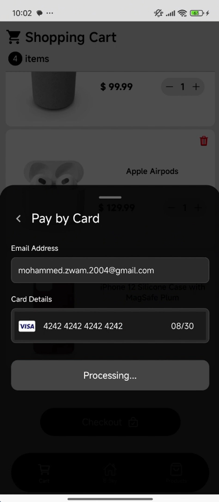

# E-Sky - Paysky Task

A mobile application developed as part of a Paysky task, showcasing product management, browsing, and payment workflow.

## Project Overview

E-Sky is a React Native mobile app that allows users to browse products and simulate a payment workflow. The backend is built with Node.js and Express, and all product data is stored in MongoDB Atlas. 


## Tech Stack

- Frontend: React Native
- Backend: Node.js & Express
- Database: MongoDB Atlas
- Payment Integration: Stripe (with Mock Payment mode for development/demo)

## Features

- Browse and view a list of products fetched from MongoDB Atlas
- Mock payment workflow to simulate transactions during development By **Stripe**
- Responsive UI optimized for mobile devices
- Error handling and alerts for payment and data fetching


This ensures that you can showcase the payment workflow safely while respecting Stripe’s security constraints.

## Installation

1. Clone the repository:

```bash
git clone https://github.com/Mohammed-Zwam/E-Sky.git
```
2. Install dependencies for both client and server:

```bash
cd client && npm install
cd ../server && npm install
```

3. Set up environment variables:

- MongoDB URI
- Stripe API keys (for real payments)

4. Run the React Native app:

```bash
cd ../client
npm start
```

## Screenshots





## Demo Video
[🔗 Watch Demo Video](https://drive.google.com/file/d/10oMG7F0hhrUlGzPYG8UL0HMV5wupbifK/view?usp=sharing)


